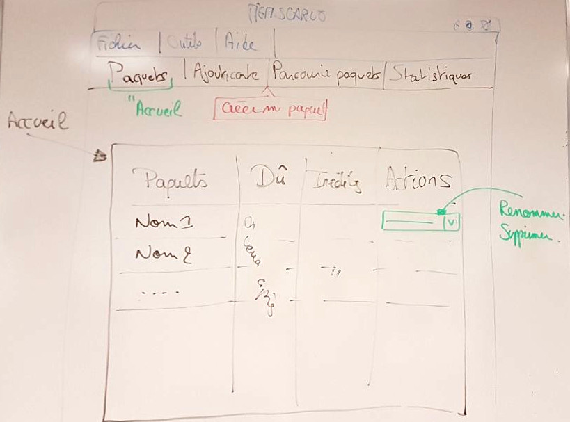
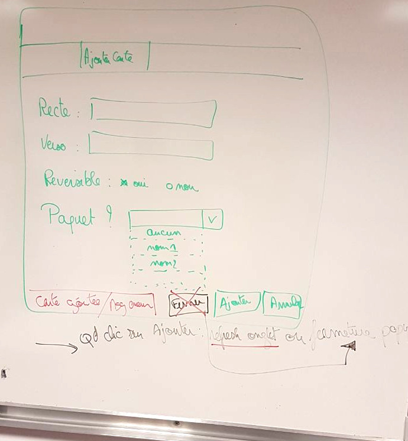
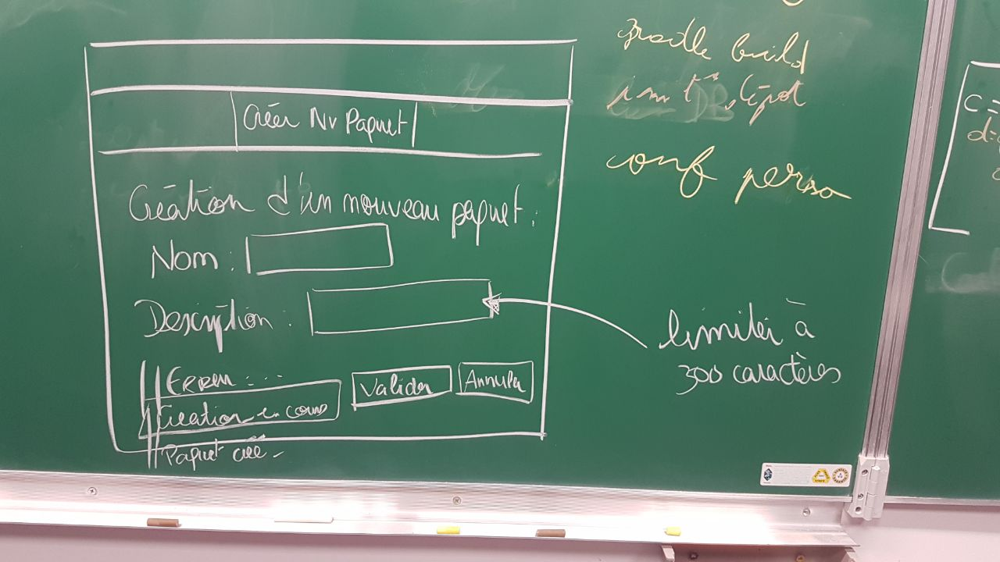
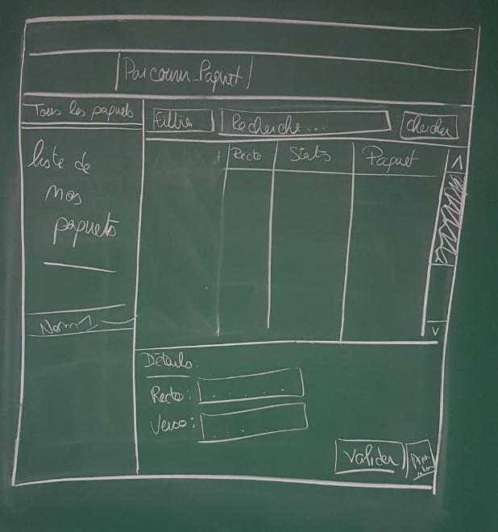

# Jour 1 : spécification générale et choix d'implémentation

## Spécification

- carte réversible : on implémente le champ booléen mais on n'utilise pas tout de suite

- Création d'une carte :
    * id : entier
    * String : recto
    * String : verso
    * boolean : reversible

- Éditer le contenu d'une carte :
    * setters et getters pour chaque champs hormis pas de setters pour l'id, sera défini à la création.
    * ~~id défini par un contenu statique propre à la classe Carte, sera incrémenté à chaque création d'une carte~~

--> on se garde le fait de traiter des images ou du son pour plus tard

- supprimer une carte :
    * nécessité que les cartes soient stockées dans une collection : ce sera géré par la base de données, on aura une table qui recensera toutes les cartes
    * ajout, suppression, modification se feront par des modifications directes dans la base de données.
    * checker comment la librairie fait le mapping entre les classes et le stockage dans la base de données

- on considère que la pile définie dans le sujet sera chez nous un paquet (en référence à anki) : une classe paquet
    * id : un entier : la base de données n'a besoin que d'un identifiant unique par table donc ok
    * nom : un String
    * une description : un String
    * id sera défini et géré par la base de données
    * la collection de cartes ? à savoir si ce sera par la base de données ou si on doit le gérer en Java ? --> on le gère avec la base de données directement
    * collection de paquets, même question --> même réponse

- exporter et importer un paquet de cartes : on stockera toutes nos données dans une base de données (SGBD : H2), à voir comment est ce qu'H2 gère sa base de données (un seul fichier ou plusieurs), etc
--> Utilisation de l'ORM "ORMLite", un mapping objet-relationnel qui se place en interface entre notre application et notre pase de données relationnelle. Permet de simuler une BD orientée objet.

La gestion des collections est directement faire par la base de données, donc cela simplifie la tâche, pas besoin de créer des collections propres

## Vues de l'interface :

Voici nos conceptions de l'interface concernant respectivement la page d'accueil :

d'ajout d'une carte : 

d'ajout d'un paquet : 

et de consultation du contenu des paquets

## Planning prévisionnel :
- Lundi : base de données ok, et dans l'IG : structuration de toute l'interface graphique, spécification en même temps
- Mardi : si IG pas toute finie, la finir. Ajout de cartes via l'IG et consultation des cartes/paquets
- Mercredi : apprentissage et statistiques : ajout du popup dans l'IG d'apprentissage + coder le prog gérant l'apprentissage (premier point)
- Jeudi : deuxième et troisième points du sujet + binôme sur extensions
- Vendredi : extensions ++

TODO : gradle test avec des junit

## Répartition du travail de lundi :
- IG : Morgan/Lucas
- BD : Clément/Laury

## Bilan de la journée : 

Bilan plutôt positif malgré une mise en place difficile de Gradle. Nous avons effectué une grosse partie de la spécification pour la création ce matin et dessiné les vues des différents onglets de notre interface.

La base de données est créée. Il existe un fichier par utilisateur dont le nom de la base de données est le surnom/pseudo de l'utilisateur. Cela permettra d'encapsuler le tout afin de pouvoir gérer par la suite plusieurs utilisateurs.

La base de données tourne via le SGBD H2 et l'ORM ORMLite. 

Le modèle est en grande partie terminé pour la création de cartes et de paquets. Il reste juste les associations cartes/paquet à peaufiner. 

L'interface graphique a grandement avancé, toutes les vues schématisées ont été implémentées. 

Un test de liaison base de données/interface graphique a été réalisé sur une nouvelle branche ce soir après la release et semble très prometteuse.

## Travail à effectuer mardi, deuxième jour de coding week :

Une phase préalable de conception des vues de l'apprentissage effectuée par tout le groupe sera nécessaire, ainsi qu'une synthèse et répartition des tâches.

Une personne, voire deux, devront se charger de continuer à effectuer la liaison entre l'interface graphique et la base de données, afin de répondre à toutes les contraintes demandées dans le sujet à ce propos.

Une personne se chargera de créer les vues concernant l'apprentissage.

Une personne se chargera de configurer l’apprentissage en définissant différents paramètres influençant la répétition des cartes (l’algorithme
de répétition, les fréquences de répétition, l’ordre de présentation)

Une personne se chargera d'effectuer les statistiques concernant les applications : quelles statistiques sont nécessaires pour une répétition des cartes, etc.

