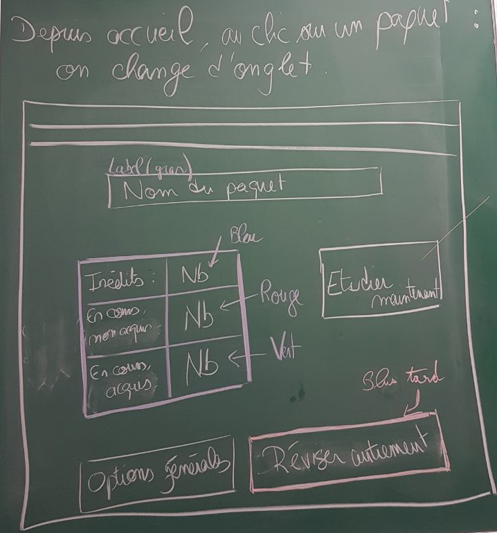
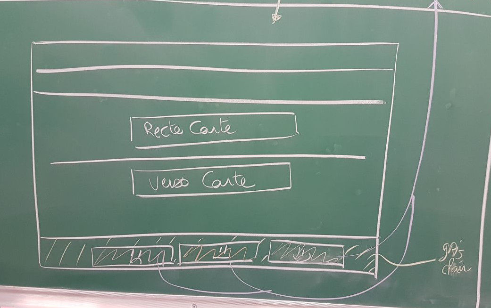

#Jour 2 : spécification et choix d'implémentation

## Scrum matinal : 
Nous avons fait le point sur le travail qui avait été fait hier soir. La JavaDoc du code créé est complète. Un premier lien entre la base de données a été effectué. La spécification d'hier soir a été terminée.

Nous avons dessiné les vues de l'interface graphique concernant l'apprentissage.

Nous avons défini les tâches de travail à effectuer aujourd'hui :

- Résoudre le problème de la taille de la fenêtre de l'interface graphique (Lucas)
- Implémenter les vues de l'interface graphique concernant l'apprentissage (Lucas)
- Continuer et terminer le lien entre la base de données et l'interface graphique concernant la création (Laury)
- Implémenter toutes les fonctionnalités liées à la création dans l'interface graphique (dont gestion d'erreur de création, et message d'ajout) (Laury)
- Effectuer des recherches et trouver les algorithmes à utiliser dans la phase d'apprentissage de l'application, et rédiger une synthèse concernant les choix effectués (Morgan)
- Effectuer des recherches concernant les statistiques nécessaires à la réalisation de l'apprentissage et implémenter leur extraction à partir de la base de données (Morgan, puis Morgan et Clément)
-  Effectuer la plannification/spécification (Laury)
- Continuer d'implémenter le lien entre les paquets et les cartes afin qu'il soit totalement fonctionnel (Clément)
- Implémenter toutes les fonctions nécessitant un accès à la base de données nécessaires (Clément)

## Vues de l'interface :

VOici nos conceptions de l'interface concernant l'apprentissage. Depuis la page d'accueil, lors d'un clic de souris sur le nom d'un paquet, on obtient l'onglet suivant :

Si l'utilisateur clique sur le bouton **Étudier maintenant** il tombe alors sur la page suivante :

Une fois qu'il a réfléchi à la réponse possible, il va devoir cliquer sur le bouton **Afficher réponse** afin de voir s'il ne s'était pas trompé ou d'afficher la réponse s'il ne la connaissait pas. Il s'affiche alors :

Lorsque l'utilisateur cliquera sur l'un des trois émojis reflétant de la difficulté qu'il a eu à trouver la réponse à la question, il retombera sur la vue précédente etc. 

## Synthèse sur le choix des algorithmes d'apprentissage :

Un algorithme permattant un apprentissage efficace est l'utilisation du système de Leitner. Dans ce système, on range les cartes par groupes, le groupe est déterminé par la connaissance des cartes. Il y a un nombre arbitraire de groupe et en fonction du groupe d'une carte, cette dernière est répétée à des intervalles plus ou moins réguliers.

Un autre algorithme nomé *SuperMemo* permet de déterminer le temps qu'il faut avant de répéter une carte en fonction du nombre de fois qu'elle a déjà été répétée et du facteur de difficulté de la carte, à savoir, avec quelle difficulté l'utilisateur a répondu à la question d'une carte.

Dans le cadre de notre projet, une combinaison des deux méthodes est intéressante à implémenter puisque la première permet de déterminer quelles cartes il faut afficher en priorité et la seconde permet de déterminer des intervalles de temps à partir desquels on peut commencer à faire apparaître à nouveau une carte.

## Affichage des statistiques

Affichage de différentes données utilisateur:
	- Diagramme en barres (Histograme) du nombre et de la date des cartes visitées
	- Diagramme en barres (Histograme) du nombre et de la date des révisions dûes 
	- Diagramme circulaire des types de cartes dans la collection (Non vue, en suspens, jeune/en apprentissage, mature)

Charts in jfx:
https://docs.oracle.com/javafx/2/charts/chart-overview.htm

