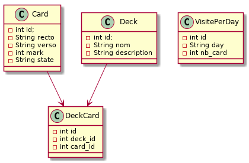

# Modèle de la base de donnée

La base de donnée H2 contient 4 tables. Celle-ci sont associées de manière transparente à des classes Java grâce à ORMLite.

## Card

## Deck

## DeckCard

On associe les cartes aux paquets dans cette table, avec les clés étrangères `deck_id` et `card_id`.

Ceci permettrait d’associer une carte à plusieurs paquets ou à aucun, même si l’application n’exploite pas cette possibilité et associe toujours une carte à un et un seul paquet.

## VisitePerDay

